# Fraud Detection & Loan Insights Using Excel

## Project Overview
Analysis of customer demographics, transactional behavior, loan applications, and fraud indicators in order to assist senior leadership in uncovering actionable insights to drive strategic decision-making.

Scroll through screenshots to see my work or download the file `Excel_Dashboard.xlsx` file contained in the "Data_Files" sub-repository.

## Dashboard Preview
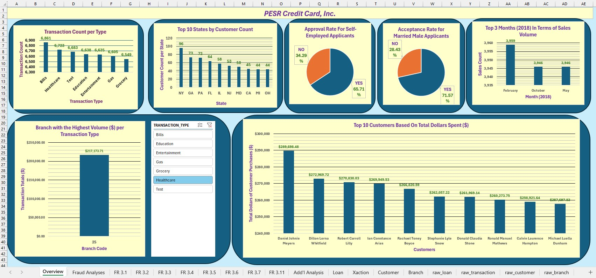
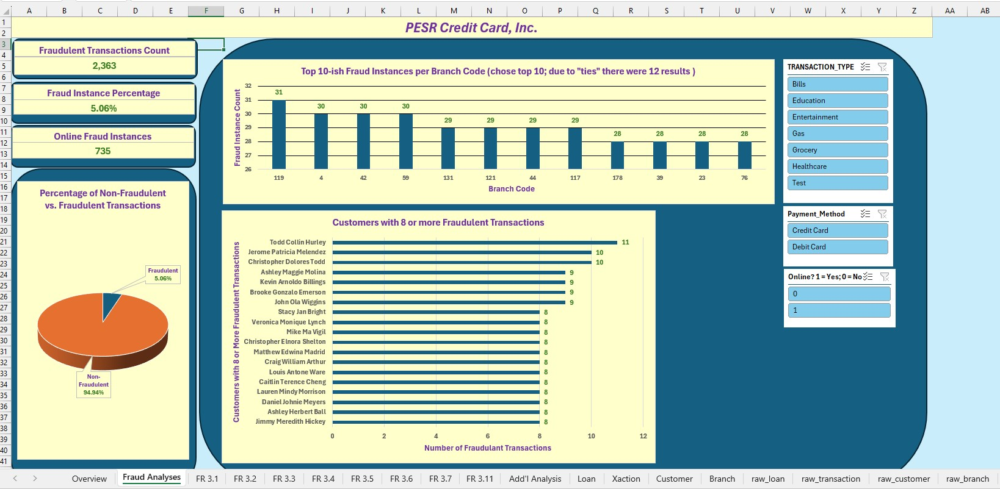
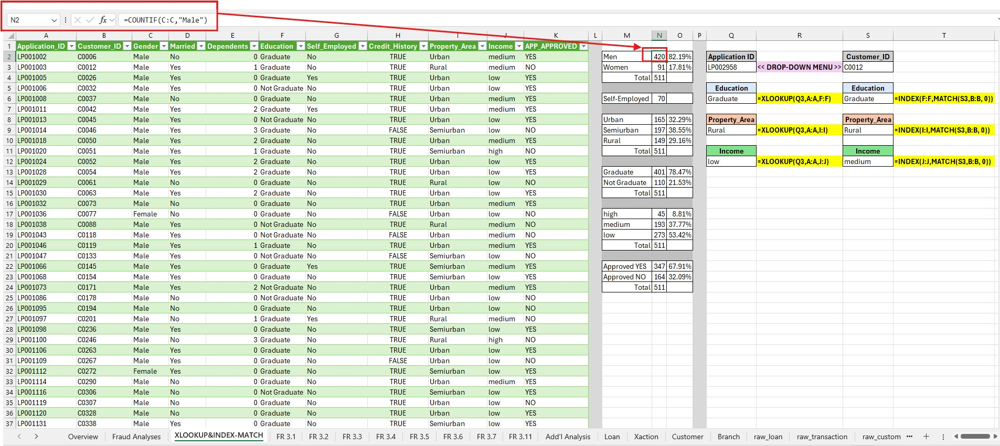
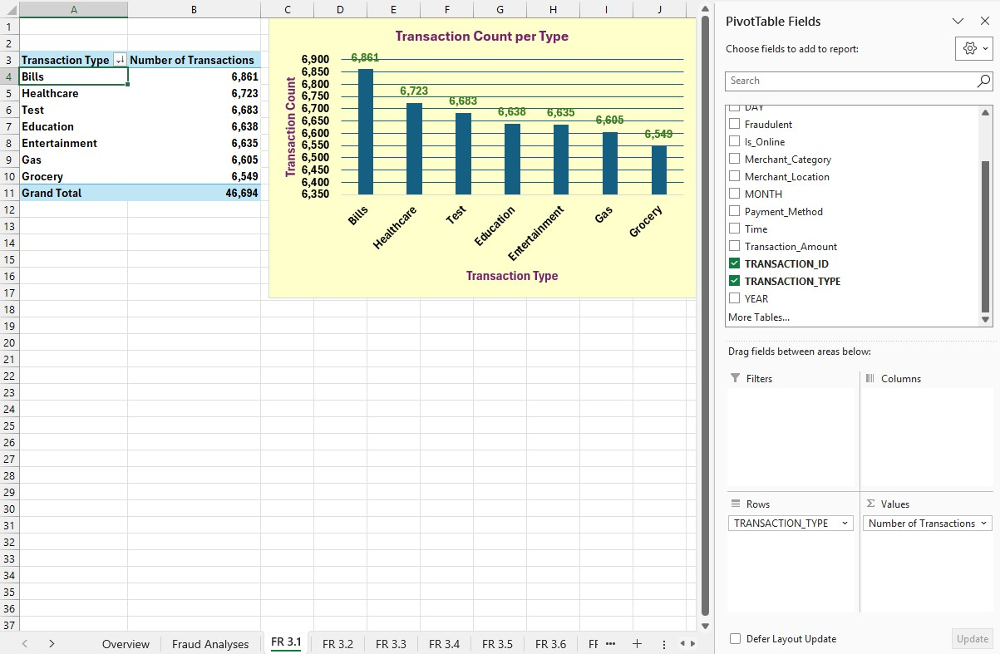
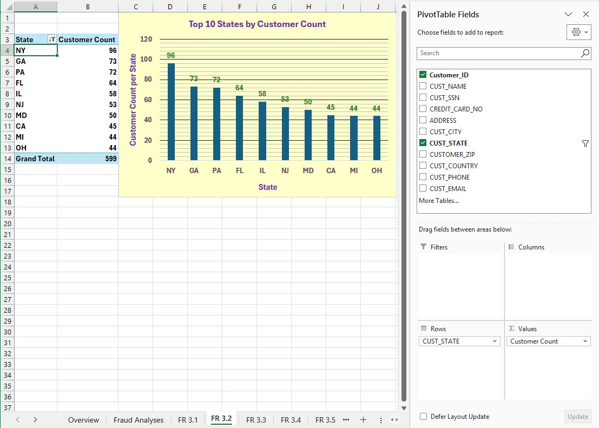
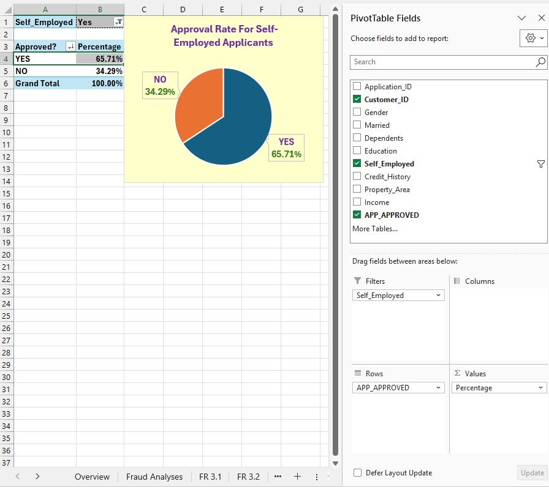
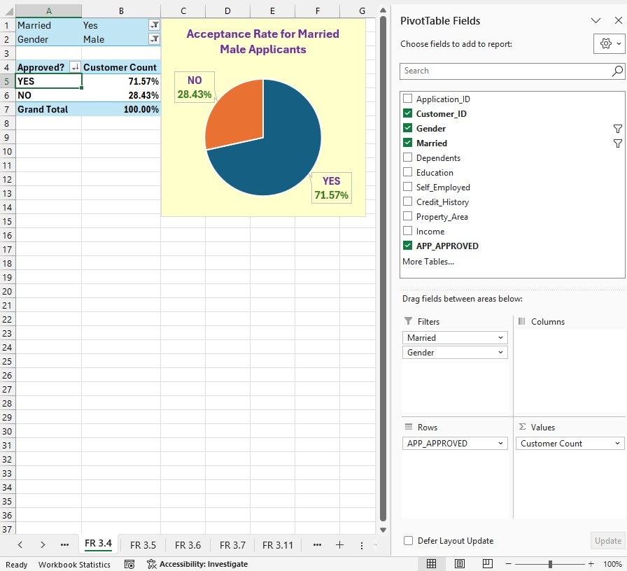
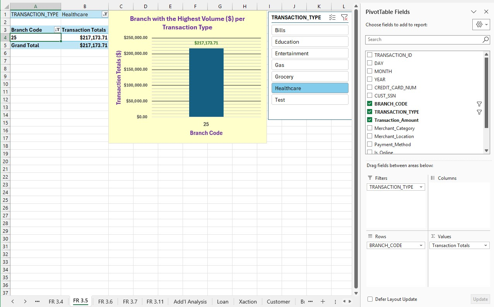
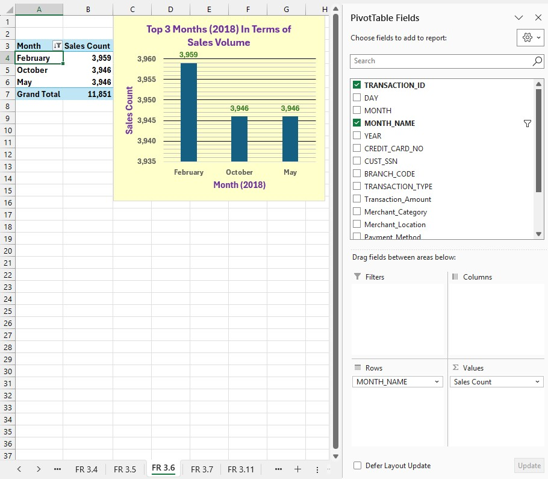
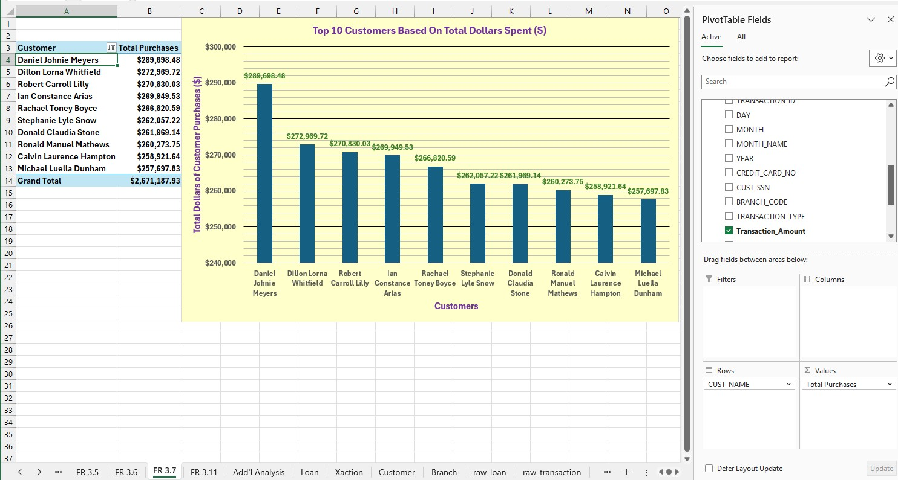
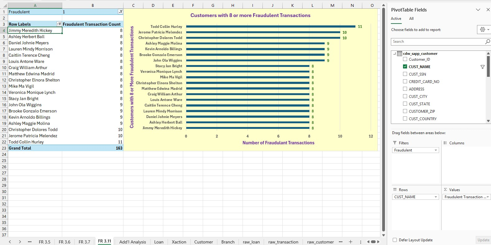
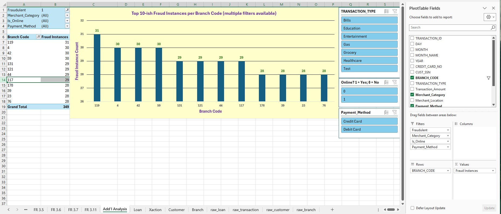
## Key Insights
- **Insight 1: 5.06% of transactions are fraudulent, totaling to 2,363 fraudulent transactions.
- **Insight 2: 12 branches have 28 or more fraudulent transactions
- **Insight 3: Bill Payments, Healthcare, and Education are the top 3 transaction types
- **Insight 4: Each of our top 10 customers have spent over $257,000

## How to View
1. Download the `Excel_Dashboard.xlsx` file contained in the "Data_Files" sub-repository.
2. Open with [Power BI Desktop](https://learn.microsoft.com/en-us/power-bi/fundamentals/desktop-get-the-desktophttps://learn.microsoft.com/en-us/power-bi/fundamentals/desktop-get-the-desktop).